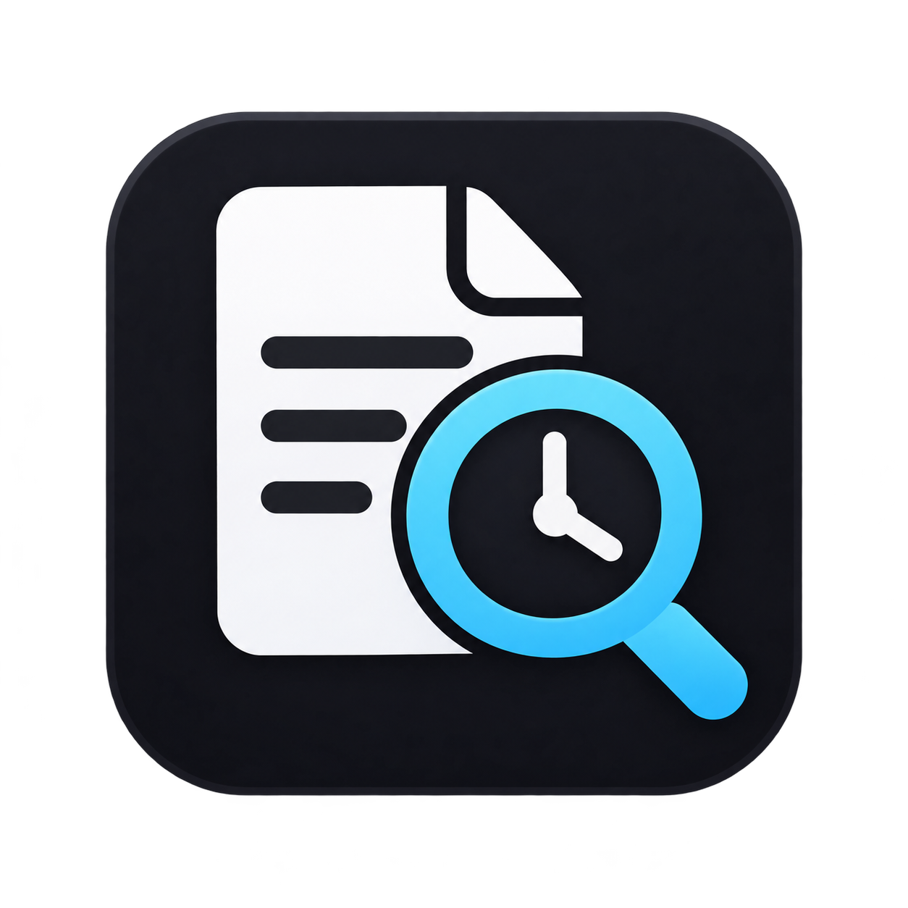

<p align="center">
  
</p>

<h1 align="center">FindHistory</h1>

<p align="center">
  Windows의 짧은 최근 항목 기록을 로컬 데이터베이스에 계속 보존하고 검색합니다.<br>
  Keep and search Windows Recent Items in a private local database.
</p>

<p align="center">
  <a href="#korean">한국어</a> · <a href="#english">English</a>
</p>

---

<a id="korean"></a>

## 한국어

### 소개

Windows의 **최근 항목** 목록은 보관 기간과 개수가 제한적입니다. FindHistory는 Windows가 만드는 최근 항목 바로가기(`.lnk`, `.url`)를 감시해 로컬 SQLite 데이터베이스에 누적하고, 파일명·전체 경로·와일드카드·날짜로 다시 찾을 수 있게 해 주는 Windows 데스크톱 앱입니다.

기록은 외부 서버로 전송하지 않으며, 사용자가 선택한 PC의 DB 파일에만 저장합니다.

### 주요 기능

- 앱 시작 시 기존 Windows 최근 항목 가져오기
- 최근 항목 폴더 실시간 감시 및 파일 감시 오류 시 자동 전체 재검사
- 동일 파일의 재등장 횟수와 마지막 기록 시각 누적
- 개별 열기 이벤트를 날짜별로 보존하고 특정 날짜만 조회
- 파일명과 전체 경로 검색, 여러 검색어 조합, `*`/`?` 와일드카드 지원
- 전체 기간 / 오늘 / 최근 7일 / 최근 30일 / 최근 1년 / 날짜 지정 필터
- 파일 열기 및 파일 탐색기에서 위치 열기
- 현재 DB를 다른 폴더로 이동하거나 기존 `findhistory.db` 선택
- 창을 닫은 뒤에도 시스템 트레이에서 백그라운드 기록
- 선택적인 Windows 로그인 시 자동 실행
- SQLite FTS5 및 검색 인덱스를 사용한 대량 기록 검색
- 네트워크 계정이나 클라우드 연결 없이 로컬에서 동작

### 검색 방법

검색창은 파일명과 전체 경로를 함께 검색합니다. `Ctrl+K`를 누르면 어디서든 검색창으로 이동합니다.

| 입력 예시 | 의미 |
| --- | --- |
| `meeting` | 파일명이나 경로에 `meeting`이 포함된 항목 |
| `*.mp4` | 확장자가 `.mp4`인 항목 |
| `clip_20??.mp4` | `?` 위치에 각각 한 글자가 들어가는 MP4 파일 |
| `project *.pdf` | `project`와 `*.pdf` 조건을 모두 만족하는 항목 |
| `D:\Work report` | 경로/파일명에서 두 검색어를 모두 만족하는 항목 |

와일드카드에서 `*`는 0개 이상의 문자, `?`는 정확히 한 문자를 뜻합니다. 여러 검색어는 **AND 조건**으로 적용됩니다.

### 날짜별 기록

기간 선택에서 **날짜 지정**을 고르면 달력의 특정 날짜에 열었던 파일만 볼 수 있습니다.

날짜 기록에는 다음과 같은 Windows 측 한계가 있습니다.

- FindHistory가 실행 중이면 최근 항목 바로가기의 변경을 감지해 개별 열기 이벤트를 기록합니다.
- 앱이 종료된 동안 같은 파일을 여러 번 열면, 다음 실행 시 Windows가 남긴 **가장 최근 바로가기 시각 한 건**만 복구할 수 있습니다.
- FindHistory를 설치하기 전에 Windows가 이미 삭제한 오래된 최근 항목은 복구할 수 없습니다.
- 이전 버전 DB를 처음 열 때 기존 `last_seen` 값은 날짜 이벤트로 이관되며 **추정 기록**으로 표시됩니다.

날짜 이력을 최대한 정확하게 남기려면 **Windows 로그인 시 백그라운드 실행**을 켜 두는 것을 권장합니다.

### 요구 사항

- Windows 10 또는 Windows 11
- 소스에서 실행/빌드: [.NET 10 SDK](https://dotnet.microsoft.com/download/dotnet/10.0)
- 프레임워크 종속 게시본 실행: .NET 10 Desktop Runtime

### 소스에서 실행

```powershell
git clone https://github.com/Code2731/FindHistory.git
cd FindHistory
dotnet run
```

Release 게시 폴더를 만들려면 다음 명령을 사용합니다.

```powershell
dotnet publish -c Release --self-contained false -o publish
```

생성된 `publish/FindHistory.exe`를 실행합니다. 창의 닫기 버튼은 앱을 시스템 트레이로 보냅니다. 완전히 종료하려면 트레이의 FindHistory 아이콘을 우클릭하고 **종료**를 선택하세요.

### 데이터 저장소와 개인정보

기본 DB 위치:

```text
%LocalAppData%\FindHistory\findhistory.db
```

설정 파일 위치:

```text
%LocalAppData%\FindHistory\settings.json
```

메인 화면의 **데이터 저장소**에서 기록을 유지한 채 DB를 다른 폴더로 옮기거나, 다른 위치의 기존 `findhistory.db`를 선택할 수 있습니다. DB는 실행 파일과 별도로 유지되므로 앱을 업데이트하거나 게시 폴더를 교체해도 기록이 남습니다.

SQLite DB는 로컬 드라이브 또는 외장 드라이브에 두는 것을 권장합니다. OneDrive 같은 실시간 동기화 폴더는 여러 장치나 프로세스가 동시에 DB에 접근할 때 충돌할 수 있습니다.

FindHistory가 읽는 범위는 Windows의 다음 최근 항목 폴더입니다.

```text
%AppData%\Microsoft\Windows\Recent
```

수집된 파일명, 경로, 날짜와 횟수는 선택한 로컬 DB에만 저장됩니다.

### 테스트와 성능

DB 저장·검색·마이그레이션·DB 이동/전환·설정 유지·실시간 파일 감시는 스모크 테스트로 검증할 수 있습니다.

```powershell
dotnet run --project tests\FindHistory.SmokeTests -c Release
```

벤치마크를 실행하려면:

```powershell
dotnet run --project benchmarks\FindHistory.Benchmarks -c Release
```

현재 최적화된 기준 구현은 10만 건 DB에서 최신 1,000건 조회 약 **4.21 ms**, `*.pdf` 1,000건 조회 약 **6.10 ms**, 최근 7일 이벤트 1,000건 조회 약 **13.42 ms**를 기록했습니다. 수치는 개발 환경에 따라 달라지며, 측정 방법과 100만 건 결과는 [성능 보고서](docs/PERFORMANCE_2026-09-24.md)에 정리되어 있습니다.

### 기술 구성

- C# / .NET 10
- WPF / MVVM
- SQLite / Microsoft.Data.Sqlite
- SQLite FTS5 trigram 검색 및 인덱스 기반 와일드카드 최적화

---

<a id="english"></a>

## English

### Overview

Windows keeps only a limited Recent Items history. FindHistory watches the recent-item shortcuts (`.lnk`, `.url`) created by Windows, stores them in a local SQLite database, and lets you find them later by file name, full path, wildcard, or date.

Your history is not sent to an external server. It remains in the database file you choose on your PC.

### Features

- Imports existing Windows Recent Items at startup
- Watches the Recent Items directory in real time and automatically rescans after watcher errors
- Tracks how often an item reappears and when it was last seen
- Preserves individual open events and filters them by an exact calendar date
- Searches file names and full paths with multiple terms and `*`/`?` wildcards
- All time / Today / Last 7 days / Last 30 days / Last year / Specific date filters
- Opens a file or reveals its location in File Explorer
- Moves the current database or switches to an existing `findhistory.db`
- Keeps recording in the system tray after the window is closed
- Optional background startup at Windows sign-in
- Uses SQLite FTS5 and dedicated indexes for large histories
- Works locally without an account or cloud connection

### Searching

The search box matches both file names and full paths. Press `Ctrl+K` to focus it from anywhere in the main window.

| Example | Meaning |
| --- | --- |
| `meeting` | Items whose name or path contains `meeting` |
| `*.mp4` | Items with the `.mp4` extension |
| `clip_20??.mp4` | MP4 names with exactly one character at each `?` |
| `project *.pdf` | Items matching both `project` and `*.pdf` |
| `D:\Work report` | Items whose path/name matches both terms |

In wildcard expressions, `*` matches zero or more characters and `?` matches exactly one character. Multiple terms are combined with **AND semantics**.

### Date history

Choose **Specific date** in the period selector to show only files opened on a selected calendar date.

Date history is subject to limitations in the Windows Recent Items source:

- While FindHistory is running, it watches shortcut changes and records individual open events.
- If the same file is opened several times while FindHistory is not running, only the **latest shortcut timestamp** left by Windows can be recovered at the next startup.
- Items already removed by Windows before FindHistory saw them cannot be recovered.
- When an older FindHistory database is upgraded, each existing `last_seen` value is migrated as an **estimated event**.

For the most accurate date history, enable **background startup at Windows sign-in**.

### Requirements

- Windows 10 or Windows 11
- To run or build from source: [.NET 10 SDK](https://dotnet.microsoft.com/download/dotnet/10.0)
- To run a framework-dependent publish: .NET 10 Desktop Runtime

### Run from source

```powershell
git clone https://github.com/Code2731/FindHistory.git
cd FindHistory
dotnet run
```

To create a Release publish directory:

```powershell
dotnet publish -c Release --self-contained false -o publish
```

Run `publish/FindHistory.exe`. Closing the main window sends the app to the system tray. To quit completely, right-click the FindHistory tray icon and choose **Exit**.

### Database and privacy

Default database location:

```text
%LocalAppData%\FindHistory\findhistory.db
```

Settings location:

```text
%LocalAppData%\FindHistory\settings.json
```

Use **Data storage** on the main screen to move the database without losing existing history, or select an existing `findhistory.db` elsewhere. The database is kept separately from the executable, so replacing or updating the publish directory does not remove your history.

A local or external drive is recommended. Real-time synchronization folders such as OneDrive may cause conflicts if multiple devices or processes access the SQLite database concurrently.

FindHistory reads shortcuts from the following Windows directory:

```text
%AppData%\Microsoft\Windows\Recent
```

Collected file names, paths, dates, and counts remain only in the selected local database.

### Tests and performance

The smoke-test project covers storage, search, migration, database move/switch, settings persistence, and live file watching.

```powershell
dotnet run --project tests\FindHistory.SmokeTests -c Release
```

Run the benchmark suite with:

```powershell
dotnet run --project benchmarks\FindHistory.Benchmarks -c Release
```

On the current development setup, the optimized implementation measured approximately **4.21 ms** for the newest 1,000 rows in a 100,000-row database, **6.10 ms** for 1,000 `*.pdf` results, and **13.42 ms** for 1,000 events from the last seven days. Results vary by machine. See the [performance report](docs/PERFORMANCE_2026-09-24.md) for the methodology and 1-million-row results.

### Technology

- C# / .NET 10
- WPF / MVVM
- SQLite / Microsoft.Data.Sqlite
- SQLite FTS5 trigram search and index-assisted wildcard queries
